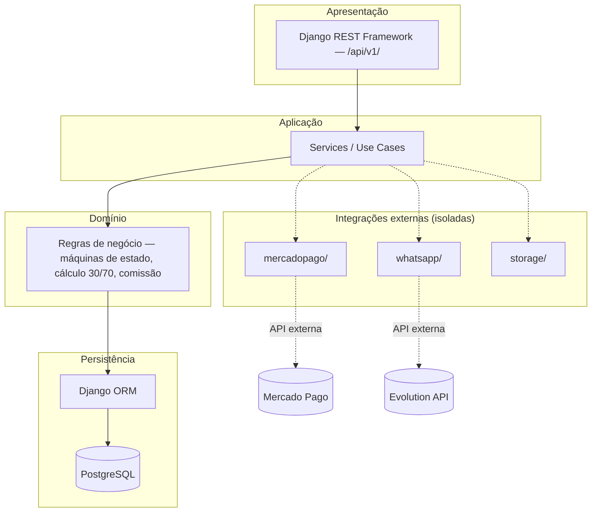
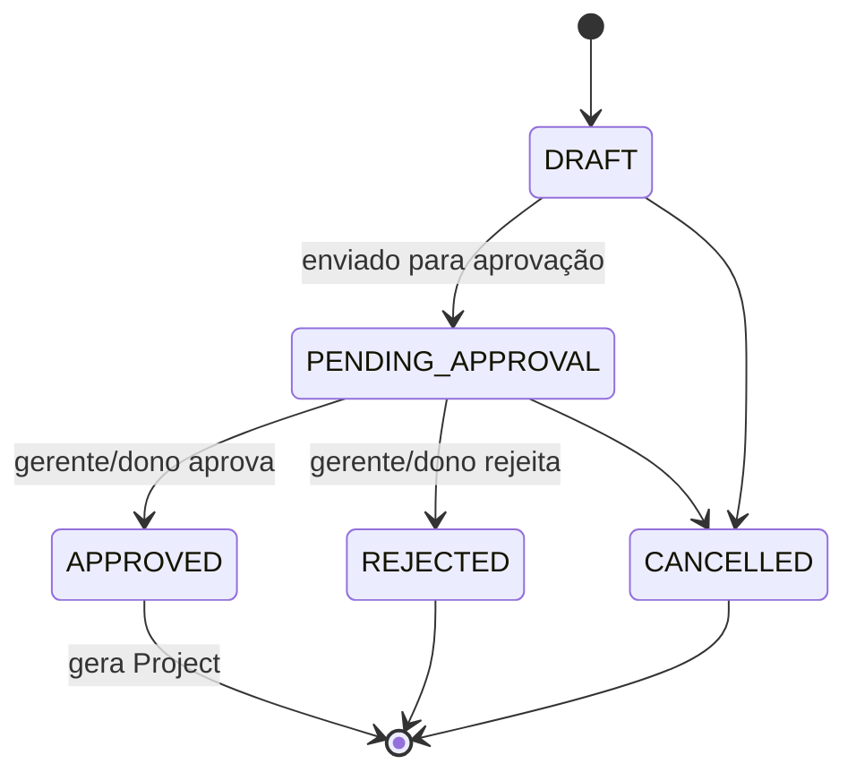
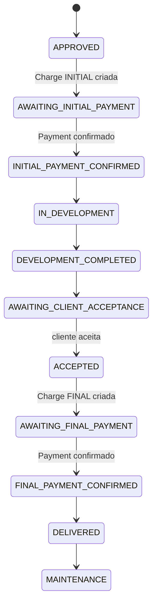
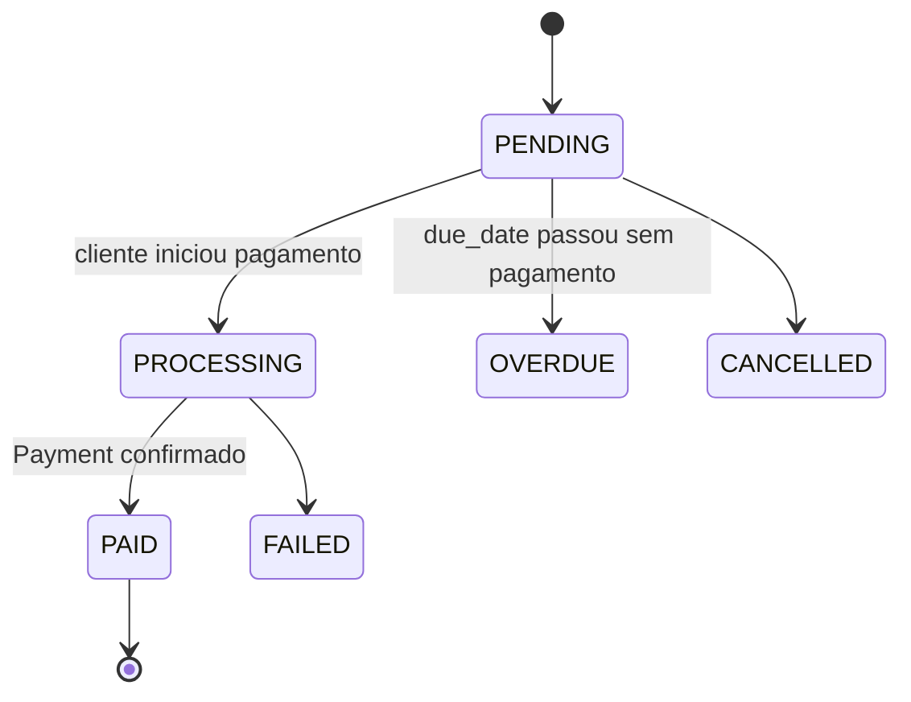
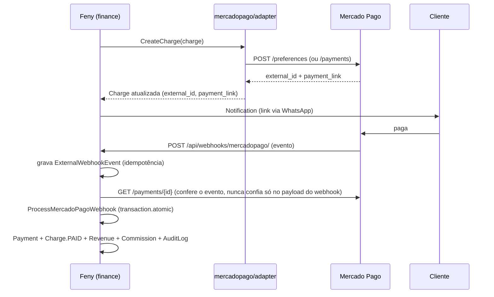
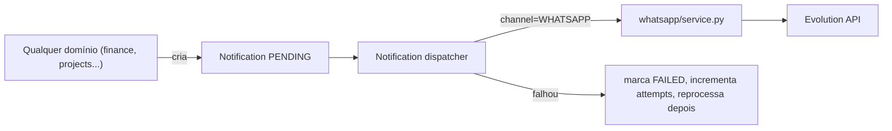

# Arquitetura Técnica — Plataforma Interna Feny

Este documento é a fonte única de verdade da arquitetura da plataforma interna da Feny. Ele traduz a visão de negócio (o que o sistema precisa fazer) e a especificação técnica (como ele deve ser construído) em uma arquitetura concreta: domínios, apps Django, modelos de dados, máquinas de estado, integrações, segurança e roadmap de implementação por fases.

Nenhum código de aplicação foi escrito ainda. Este documento existe para ser a base de todas as fases de desenvolvimento que virão depois dele.

---

## 1. Visão geral

A Feny é uma software house que presta serviços de desenvolvimento sob medida (sistemas, automações, sites, PWAs, apps, SaaS, integrações) para outras empresas. Este sistema é a **plataforma operacional interna** da Feny — não um produto vendido a terceiros.

Ela precisa centralizar: clientes, orçamentos, projetos, financeiro, cobranças (Mercado Pago), comunicação (Evolution API/WhatsApp), documentos, comissões de vendedores, usuários/permissões, auditoria e dashboards — numa base que cresce por fases, sem reescrita.

### Fluxo de negócio central

```mermaid
flowchart LR
    A[Cliente] --> B[Orçamento]
    B -->|Aprovação do gerente/dono| C[Projeto]
    C --> D["Cobrança 30% (inicial)"]
    D -->|Pago| E[Em desenvolvimento]
    E --> F[Desenvolvimento concluído]
    F --> G[Aceite do cliente]
    G --> H["Cobrança 70% (final)"]
    H -->|Pago| I[Entregue]
    I --> J[Manutenção / recorrência]
```



Em paralelo, três eixos cruzam esse fluxo em todo ponto relevante: **Financeiro** (receitas, despesas, contas a receber, comissões, fluxo de caixa), **Mercado Pago** (cobranças, pagamentos, webhooks) e **Auditoria** (quem fez o quê, quando, e qual era o estado antes/depois).

---

## 2. Princípios arquiteturais

Estes princípios (da especificação de negócio, seção 4) governam toda decisão técnica abaixo:

- Separação clara de responsabilidades, baixo acoplamento, alta coesão
- Segurança desde o início — autorização sempre no backend, nunca no frontend
- Nenhuma confiança em dado vindo do cliente/frontend para decisões financeiras
- Regras de negócio centralizadas — uma fonte de verdade por regra
- Integrações externas isoladas do núcleo (Mercado Pago e Evolution API nunca "vazam" para dentro do domínio financeiro)
- Idempotência obrigatória em webhooks e operações financeiras
- Nenhum segredo no código ou no Git
- Auditoria como parte estrutural, não um extra
- Não adicionar complexidade (microsserviços, event sourcing, filas) sem necessidade real comprovada

---

## 3. Stack e decisão arquitetural

| Camada | Escolha |
|---|---|
| Linguagem/Framework | Python + Django + Django REST Framework |
| Banco de dados | PostgreSQL |
| Arquitetura | **Monólito modular** (não microsserviços) |
| Pagamentos | Mercado Pago, via camada de integração isolada |
| WhatsApp | Evolution API, via camada de integração isolada |
| Armazenamento de arquivos | Abstração de storage (local em dev, externo em produção) |
| Assíncrono | Celery + Redis — **somente quando uma necessidade real existir** (ver §17) |
| Autenticação | Django Auth + Custom User + RBAC (grupos/permissões) |
| 2FA | Obrigatório para contas administrativas/dono |
| Ambientes | Desenvolvimento, Staging, Produção — nunca testar em produção |

Um microsserviço, fila ou banco adicional só entra quando um requisito real (não hipotético) o justificar. A primeira versão da plataforma é: **Django + PostgreSQL + monólito modular + integrações isoladas.**

---

## 4. Arquitetura em camadas



Regra de dependência: **domínio não depende de integração**. `finance/` conhece conceitos como `Charge`, `Payment`, `PaymentStatus`; quem sabe o que é um "Mercado Pago payment_id" é só a camada `mercadopago/`. O mesmo vale para `whatsapp/` em relação a `notifications/`.

---

## 5. Estrutura de apps Django

Um app por domínio coeso — nem um app monolítico único, nem um app por model.

```
feny/
├── config/                  # settings, urls raiz, wsgi/asgi, celery.py
│   ├── settings/
│   │   ├── base.py
│   │   ├── dev.py
│   │   ├── staging.py
│   │   └── production.py
│   ├── urls.py
│   └── celery.py
├── apps/
│   ├── core/                # base models, mixins, exceptions, permissions base, enums comuns
│   ├── users/                # Custom User, cargos, RBAC, 2FA
│   ├── customers/            # clientes/empresas, contatos, método de pagamento preferido
│   ├── quotations/           # orçamentos, aprovação
│   ├── projects/             # projetos, tipos, máquina de estado
│   ├── finance/               # charges, payments, revenue, expense, commission, recurring
│   ├── documents/            # metadados de documentos + abstração de storage
│   ├── notifications/        # domínio de notificação, agnóstico de canal
│   ├── whatsapp/              # integração isolada com Evolution API
│   ├── mercadopago/           # integração isolada com Mercado Pago
│   ├── audit/                 # AuditLog, ExternalWebhookEvent
│   ├── dashboard/             # agregações e métricas de leitura
│   └── reports/               # relatórios (fase posterior)
├── manage.py
├── requirements/
│   ├── base.txt
│   ├── dev.txt
│   └── production.txt
├── docker-compose.yml
├── Dockerfile
├── .env.example
└── tests/                    # fixtures e testes de integração cross-app, quando necessário
```

`finance/` é um único app com múltiplos models bem separados internamente (`finance/models/charges.py`, `payments.py`, `revenues.py`, `expenses.py`, `commissions.py`, `recurring.py`) — evita fragmentar em `payments/`, `billing/`, `commissions/` como apps separados sem necessidade, mas mantém a separação interna clara.

---

## 6. Domínios e modelos de dados

Convenção geral: `id` UUID como chave primária em entidades que cruzam fronteira de API/integração externa (facilita não vazar sequência incremental e evita colisão em idempotência); `created_at`/`updated_at` timezone-aware em tudo; dinheiro sempre `DecimalField(max_digits=12, decimal_places=2)`, nunca `float`.

### 6.1 `users`

```python
class User(AbstractUser):
    id = UUIDField(primary_key=True, default=uuid4)
    role = CharField(choices=Role.choices)   # ADMIN, DEVELOPER, SALES, SUPPORT, FINANCE, MANAGER
    is_active = BooleanField(default=True)
    two_factor_enabled = BooleanField(default=False)
    last_login_at = DateTimeField(null=True)
    created_at = DateTimeField(auto_now_add=True)
```

- `Role` é o cargo (usado para RBAC "de largada" via Django Groups mapeados 1:1 a cada `role` na Fase 1). Permissões mais finas (por objeto, ex.: "só vê os próprios orçamentos") vivem em `permissions.py` de cada app, não em `role` isolado — ver §9.
- `AbstractUser` do Django como base (não o `User` padrão) — permite estender sem migração dolorosa depois.

### 6.2 `customers`

```python
class Customer(BaseModel):
    id = UUIDField(primary_key=True, default=uuid4)
    kind = CharField(choices=[("INDIVIDUAL", ...), ("COMPANY", ...)])
    legal_name = CharField()              # razão social ou nome completo
    document = CharField(unique=True)     # CPF ou CNPJ, validado conforme `kind`
    email = EmailField()
    phone = CharField()
    preferred_payment_method = CharField(choices=PaymentMethod.choices)  # BOLETO, CARD
    created_at = DateTimeField(auto_now_add=True)
    updated_at = DateTimeField(auto_now=True)

class CustomerContact(BaseModel):
    customer = ForeignKey(Customer, related_name="contacts")
    name = CharField()
    role = CharField(blank=True)
    email = EmailField(blank=True)
    phone = CharField(blank=True)
```

Sem CRM, sem histórico de comunicação — conforme escopo definido (spec de negócio §7).

### 6.3 `quotations`

```python
class QuotationStatus(TextChoices):
    DRAFT = "DRAFT"
    PENDING_APPROVAL = "PENDING_APPROVAL"
    APPROVED = "APPROVED"
    REJECTED = "REJECTED"
    CANCELLED = "CANCELLED"

class Quotation(BaseModel):
    id = UUIDField(primary_key=True, default=uuid4)
    customer = ForeignKey(Customer, related_name="quotations")
    sales_rep = ForeignKey(User, related_name="quotations")
    service_type = CharField()            # referencia os tipos de projeto, §6.4
    description = TextField()
    amount = DecimalField(max_digits=12, decimal_places=2)
    deadline_days = PositiveIntegerField(null=True)
    status = CharField(choices=QuotationStatus.choices, default=DRAFT)
    notes = TextField(blank=True)
    created_at = DateTimeField(auto_now_add=True)
    decided_at = DateTimeField(null=True)
    decided_by = ForeignKey(User, null=True, related_name="+")
```

### 6.4 `projects`

```python
class ProjectType(TextChoices):
    SYSTEM = "SYSTEM"; AUTOMATION = "AUTOMATION"; WEBSITE = "WEBSITE"
    PWA = "PWA"; APP = "APP"; SAAS = "SAAS"; OTHER = "OTHER"

class ProjectStatus(TextChoices):
    APPROVED = "APPROVED"
    AWAITING_INITIAL_PAYMENT = "AWAITING_INITIAL_PAYMENT"
    INITIAL_PAYMENT_CONFIRMED = "INITIAL_PAYMENT_CONFIRMED"
    IN_DEVELOPMENT = "IN_DEVELOPMENT"
    DEVELOPMENT_COMPLETED = "DEVELOPMENT_COMPLETED"
    AWAITING_CLIENT_ACCEPTANCE = "AWAITING_CLIENT_ACCEPTANCE"
    ACCEPTED = "ACCEPTED"
    AWAITING_FINAL_PAYMENT = "AWAITING_FINAL_PAYMENT"
    FINAL_PAYMENT_CONFIRMED = "FINAL_PAYMENT_CONFIRMED"
    DELIVERED = "DELIVERED"
    MAINTENANCE = "MAINTENANCE"

class Project(BaseModel):
    id = UUIDField(primary_key=True, default=uuid4)
    customer = ForeignKey(Customer, related_name="projects")
    quotation = OneToOneField(Quotation, related_name="project")
    name = CharField()
    project_type = CharField(choices=ProjectType.choices)
    description = TextField(blank=True)
    responsible = ForeignKey(User, related_name="projects_responsible")
    amount = DecimalField(max_digits=12, decimal_places=2)   # snapshot do valor aprovado
    status = CharField(choices=ProjectStatus.choices, default=APPROVED)
    expected_delivery_at = DateField(null=True)
    delivered_at = DateTimeField(null=True)
    created_at = DateTimeField(auto_now_add=True)
```

Um `Project` nasce de um `Quotation` aprovado (relação 1:1) — nunca é criado solto. Ver máquina de estado em §7.

### 6.5 `finance`

```python
class ChargeType(TextChoices):
    INITIAL = "INITIAL"     # os 30%
    FINAL = "FINAL"         # os 70%
    RECURRING = "RECURRING" # mensalidade/serviço recorrente
    SCOPE_CHANGE = "SCOPE_CHANGE"

class ChargeStatus(TextChoices):
    PENDING = "PENDING"
    PROCESSING = "PROCESSING"
    PAID = "PAID"
    OVERDUE = "OVERDUE"
    CANCELLED = "CANCELLED"
    FAILED = "FAILED"

class Charge(BaseModel):
    """Uma obrigação financeira cobrável — o 'contas a receber'."""
    id = UUIDField(primary_key=True, default=uuid4)
    project = ForeignKey(Project, null=True, related_name="charges")
    recurring_subscription = ForeignKey("RecurringSubscription", null=True, related_name="charges")
    customer = ForeignKey(Customer, related_name="charges")
    charge_type = CharField(choices=ChargeType.choices)
    percentage = DecimalField(max_digits=5, decimal_places=2, null=True)  # 30.00 / 70.00
    amount = DecimalField(max_digits=12, decimal_places=2)
    due_date = DateField()
    status = CharField(choices=ChargeStatus.choices, default=PENDING)
    payment_method = CharField(choices=PaymentMethod.choices)
    external_provider = CharField(default="mercadopago")
    external_id = CharField(unique=True, null=True)   # id da cobrança no Mercado Pago
    payment_link = URLField(blank=True)
    paid_at = DateTimeField(null=True)
    created_at = DateTimeField(auto_now_add=True)

class Payment(BaseModel):
    """O recebimento confirmado de uma Charge — pode existir 1:1 na prática, mas
    é entidade própria porque 'cobrança criada' e 'dinheiro recebido' são dois
    eventos, não um."""
    id = UUIDField(primary_key=True, default=uuid4)
    charge = ForeignKey(Charge, related_name="payments")
    amount = DecimalField(max_digits=12, decimal_places=2)
    external_id = CharField(unique=True)     # payment_id do Mercado Pago — idempotência
    method = CharField()
    paid_at = DateTimeField()
    raw_payload = JSONField()                # payload bruto do provedor, para auditoria
    created_at = DateTimeField(auto_now_add=True)

class Revenue(BaseModel):
    id = UUIDField(primary_key=True, default=uuid4)
    source = CharField(choices=[("PROJECT", ...), ("RECURRING", ...), ("OTHER", ...)])
    payment = OneToOneField(Payment, null=True, related_name="revenue")
    amount = DecimalField(max_digits=12, decimal_places=2)
    description = CharField(blank=True)
    received_at = DateTimeField()
    created_at = DateTimeField(auto_now_add=True)

class Expense(BaseModel):
    class Status(TextChoices):
        PENDING = "PENDING"; PAID = "PAID"; OVERDUE = "OVERDUE"; CANCELLED = "CANCELLED"

    id = UUIDField(primary_key=True, default=uuid4)
    category = CharField()                  # infra, software, fornecedor, funcionário...
    description = CharField()
    amount = DecimalField(max_digits=12, decimal_places=2)
    due_date = DateField()
    paid_at = DateTimeField(null=True)
    status = CharField(choices=Status.choices, default=PENDING)
    document = ForeignKey("documents.Document", null=True, related_name="+")
    created_by = ForeignKey(User, related_name="+")

class Commission(BaseModel):
    class Status(TextChoices):
        PENDING = "PENDING"; PAID = "PAID"

    id = UUIDField(primary_key=True, default=uuid4)
    sales_rep = ForeignKey(User, related_name="commissions")
    project = ForeignKey(Project, related_name="commissions")
    payment = OneToOneField(Payment, related_name="commission")  # nunca existe sem recebimento
    percentage = DecimalField(max_digits=5, decimal_places=2, default=Decimal("10.00"))
    amount = DecimalField(max_digits=12, decimal_places=2)
    status = CharField(choices=Status.choices, default=PENDING)
    generated_at = DateTimeField(auto_now_add=True)
    paid_at = DateTimeField(null=True)

class RecurringSubscription(BaseModel):
    class Status(TextChoices):
        ACTIVE = "ACTIVE"; PAUSED = "PAUSED"; CANCELLED = "CANCELLED"

    id = UUIDField(primary_key=True, default=uuid4)
    customer = ForeignKey(Customer, related_name="subscriptions")
    project = ForeignKey(Project, null=True, related_name="subscriptions")
    service_description = CharField()       # hospedagem, manutenção, SaaS...
    amount = DecimalField(max_digits=12, decimal_places=2)
    frequency = CharField(choices=[("MONTHLY", ...)], default="MONTHLY")
    start_date = DateField()
    next_billing_date = DateField()
    status = CharField(choices=Status.choices, default=ACTIVE)
    external_id = CharField(null=True)      # assinatura no Mercado Pago, se aplicável
```

Pontos que a modelagem protege deliberadamente (spec técnica §18–20):

- `Charge` e `Payment` são entidades separadas: uma cobrança pode existir sem nunca ser paga; um pagamento nunca existe sem cobrança.
- `Commission.payment` é `OneToOneField` **obrigatório** — impossível, a nível de banco, gerar comissão sem um recebimento real por trás.
- `Payment.external_id` é `unique` — segunda notificação do mesmo `payment_id` do Mercado Pago não gera segundo `Payment` (idempotência).
- `Charge` de projeto (30%/70%) e `Charge` recorrente compartilham a mesma tabela (mesmo conceito: "obrigação cobrável"), diferenciadas por `charge_type` — evita duplicar o conceito de cobrança em duas tabelas paralelas.

### 6.6 `documents`

```python
class DocumentCategory(TextChoices):
    CONTRACT = "CONTRACT"; INVOICE = "INVOICE"; RECEIPT = "RECEIPT"
    PROJECT_FILE = "PROJECT_FILE"; OTHER = "OTHER"

class Document(BaseModel):
    id = UUIDField(primary_key=True, default=uuid4)
    customer = ForeignKey(Customer, null=True, related_name="documents")
    project = ForeignKey(Project, null=True, related_name="documents")
    category = CharField(choices=DocumentCategory.choices)
    original_filename = CharField()
    mime_type = CharField()
    size_bytes = PositiveIntegerField()
    checksum_sha256 = CharField()
    storage_key = CharField()          # caminho no storage, não o arquivo em si
    uploaded_by = ForeignKey(User, related_name="+")
    created_at = DateTimeField(auto_now_add=True)
```

O binário nunca entra no PostgreSQL. `storage_key` é resolvido por uma abstração de storage (§14) — filesystem local em dev, storage externo (S3-compatível) em produção.

### 6.7 `notifications`

```python
class NotificationChannel(TextChoices):
    WHATSAPP = "WHATSAPP"; EMAIL = "EMAIL"; INTERNAL = "INTERNAL"

class NotificationStatus(TextChoices):
    PENDING = "PENDING"; SENT = "SENT"; FAILED = "FAILED"

class Notification(BaseModel):
    id = UUIDField(primary_key=True, default=uuid4)
    channel = CharField(choices=NotificationChannel.choices)
    recipient = CharField()             # telefone ou e-mail, resolvido no momento do envio
    template = CharField()              # "charge.created", "payment.received", ...
    context = JSONField()
    status = CharField(choices=NotificationStatus.choices, default=PENDING)
    attempts = PositiveSmallIntegerField(default=0)
    last_error = TextField(blank=True)
    created_at = DateTimeField(auto_now_add=True)
    sent_at = DateTimeField(null=True)
```

`finance` (e qualquer outro domínio) cria uma `Notification` e não sabe nem precisa saber que existe Evolution API por trás — quem consome a fila de notificações pendentes e efetivamente envia é `whatsapp/` (ou `email/`, no futuro). Uma falha de envio nunca reverte uma transação financeira (spec técnica §59).

### 6.8 `mercadopago` (integração isolada)

Sem modelo de domínio próprio — só `client.py` (chamadas HTTP autenticadas), `adapter.py` (traduz `Charge`/`Payment` internos ↔ formato do Mercado Pago), `webhooks.py` (recebe e valida eventos) e `exceptions.py`. Ver fluxo completo em §10.

### 6.9 `whatsapp` (integração isolada)

Mesmo padrão: `client.py` fala com a Evolution API, `service.py` expõe `send(notification: Notification)` para o domínio `notifications`. Nenhum outro app importa `whatsapp` diretamente.

### 6.10 `audit`

```python
class AuditLog(BaseModel):
    id = UUIDField(primary_key=True, default=uuid4)
    user = ForeignKey(User, null=True, related_name="audit_logs")  # null = ação do sistema
    action = CharField()                 # "quotation.approved", "charge.paid", ...
    entity_type = CharField()
    entity_id = CharField()
    before = JSONField(null=True)
    after = JSONField(null=True)
    metadata = JSONField(default=dict)
    created_at = DateTimeField(auto_now_add=True, db_index=True)

class ExternalWebhookEvent(BaseModel):
    class Status(TextChoices):
        RECEIVED = "RECEIVED"; PROCESSED = "PROCESSED"; FAILED = "FAILED"; IGNORED = "IGNORED"

    id = UUIDField(primary_key=True, default=uuid4)
    provider = CharField()               # "mercadopago"
    external_event_id = CharField()
    event_type = CharField()
    payload = JSONField()
    status = CharField(choices=Status.choices, default=RECEIVED)
    error = TextField(blank=True)
    attempts = PositiveSmallIntegerField(default=0)
    received_at = DateTimeField(auto_now_add=True)
    processed_at = DateTimeField(null=True)

    class Meta:
        constraints = [
            UniqueConstraint(fields=["provider", "external_event_id"], name="uq_webhook_event")
        ]
```

A `UniqueConstraint` em `(provider, external_event_id)` é o que garante, a nível de banco, que o mesmo evento do Mercado Pago processado duas vezes não gera dois efeitos.

---

## 7. Máquinas de estado

Nenhuma entidade muda de status por atribuição livre de campo — toda transição passa por um método de domínio que valida a transição e registra auditoria.

### 7.1 Orçamento (`Quotation`)



Regra dura: quem aprova (`decided_by`) **nunca** pode ser o mesmo usuário de `sales_rep` — validado no service `ApproveQuotation`, não no formulário.

### 7.2 Projeto (`Project`)



Guardas explícitas (implementadas em `projects/services.py`, não em `save()` do model):

| Transição | Guarda |
|---|---|
| `AWAITING_INITIAL_PAYMENT → INITIAL_PAYMENT_CONFIRMED` | Só via `ConfirmPayment`, disparado pelo webhook do Mercado Pago — nunca por um funcionário marcando manualmente |
| `DEVELOPMENT_COMPLETED → AWAITING_CLIENT_ACCEPTANCE` | Automática ao marcar desenvolvimento concluído |
| `AWAITING_CLIENT_ACCEPTANCE → ACCEPTED` | Evento explícito de aceite — nunca inferido |
| `ACCEPTED → AWAITING_FINAL_PAYMENT` | Dispara `CreateFinalCharge`, que cria o `Charge FINAL` |
| `AWAITING_FINAL_PAYMENT → FINAL_PAYMENT_CONFIRMED → DELIVERED` | Mesmo caminho do pagamento inicial, via webhook |

### 7.3 Cobrança (`Charge`) / Pagamento



---

## 8. Regras de negócio centrais

### 8.1 Divisão 30/70

Ao entrar em `AWAITING_INITIAL_PAYMENT`, o service `CreateInitialCharge` cria **uma** `Charge`:

```
Charge(charge_type=INITIAL, percentage=30.00, amount=project.amount * Decimal("0.30"), ...)
```

A `Charge FINAL` (70%) só é criada depois do aceite (`ACCEPTED → AWAITING_FINAL_PAYMENT`), pelo service `CreateFinalCharge`, com `amount = project.amount - already_charged`. Usar subtração do já cobrado (não recalcular `0.70 * amount` de novo) evita divergência de centavos por arredondamento.

Uma vez uma `Charge` emitida (tem `external_id` do Mercado Pago), seu `amount` é **imutável** — qualquer ajuste vira uma nova `Charge` do tipo `SCOPE_CHANGE`, nunca uma edição silenciosa.

### 8.2 Comissão (10% sobre recebido)

`GenerateCommission` roda **depois** que um `Payment` é confirmado (nunca antes):

```
Commission(payment=payment, percentage=10.00, amount=payment.amount * Decimal("0.10"), status=PENDING)
```

Impossível existir uma `Commission` sem `Payment` (FK obrigatória) — a comissão nunca é "prometida", só gerada sobre dinheiro que já entrou.

### 8.3 Idempotência

Três camadas de proteção, não uma só:

1. **Banco**: `Payment.external_id` `unique`; `ExternalWebhookEvent(provider, external_event_id)` `unique together`.
2. **Aplicação**: `ProcessMercadoPagoWebhook` primeiro grava o `ExternalWebhookEvent`; se a constraint de unicidade disparar, o evento já existe — encerra sem reprocessar (nenhuma exceção tratada como erro).
3. **Transação**: a cadeia `Payment → Charge.status=PAID → Revenue → Commission → AuditLog` roda inteira dentro de `transaction.atomic()` — ou tudo se aplica, ou nada.

### 8.4 Dinheiro é sempre `Decimal`

Nenhum `float` em nenhum model, service ou serializer que toque valor monetário. Percentuais também são `Decimal` (`Decimal("0.30")`, nunca `0.3`).

---

## 9. Permissões e papéis (RBAC)

Base: Django `Groups` (um por `Role`) + `Permissions` padrão do Django (`add_`, `change_`, `delete_`, `view_`) por model, mais permissões customizadas para ações de domínio que não são CRUD (`can_approve_quotation`, `can_confirm_manual_payment` etc. — esta última proposital: **não existe** permissão de "confirmar pagamento manualmente" para operação normal, só via webhook; existe apenas para correção administrativa auditada).

| Papel | Customers | Quotations | Projects | Finance | Documents | Audit | Settings |
|---|---|---|---|---|---|---|---|
| **Admin** | CRUD | CRUD + aprova | CRUD | CRUD | CRUD | Vê | CRUD |
| **Manager/Dono** | CRUD | CRUD + aprova | CRUD | Vê | CRUD | Vê | — |
| **Sales** | Cria/edita os próprios | Cria/edita os próprios (não aprova) | Vê os relacionados | Vê as próprias comissões | Vê os relacionados | — | — |
| **Developer** | Vê | Vê | Edita os designados | — | Vê/anexa nos projetos | — | — |
| **Finance** | Vê | Vê | Vê | CRUD | CRUD | Vê | — |
| **Support** | Vê/edita limitado | Vê | Vê | — | Vê | — | — |

Regra dura reforçada no backend (não é sugestão de UI): um `Quotation` com `sales_rep == request.user` não pode ser aprovado pelo mesmo `request.user`, mesmo que ele tecnicamente tenha a permissão `can_approve_quotation` por outro motivo — o service verifica identidade, não só permissão.

Escopo "só vejo o que é meu" (vendedor vendo só seus orçamentos/comissões) é filtro de queryset por `request.user`, aplicado no `ViewSet.get_queryset()` — nunca no frontend.

---

## 10. Integração Mercado Pago



Pontos não negociáveis (spec técnica §21–25):

- Nenhuma chamada HTTP ao Mercado Pago fora de `apps/mercadopago/`.
- O webhook **nunca** confia cegamente no payload recebido — sempre confirma consultando a API do Mercado Pago pelo `external_id` antes de dar baixa financeira.
- Status do Mercado Pago é **mapeado** para o `ChargeStatus` interno (`mercadopago/adapter.py::map_status`), nunca copiado direto — o domínio preserva sua própria semântica.
- Endpoint do webhook: `POST /api/webhooks/mercadopago/`, fora do versionamento público `/api/v1/` (webhooks de provedor externo têm contrato do provedor, não nosso).

---

## 11. Integração Evolution API / Notificações



`finance` (ou qualquer outro app) nunca importa `whatsapp`. Ele cria uma `Notification` e termina ali — o envio é responsabilidade de outro processo, e uma falha de envio **nunca** desfaz a transação financeira que a originou (spec técnica §59, regra crítica).

---

## 12. API

- Prefixo: `/api/v1/` para tudo consumido por frontend/apps/integrações internas.
- Webhooks de provedores externos ficam fora do versionamento: `/api/webhooks/<provider>/`.
- DRF `ModelViewSet`/`GenericAPIView` por recurso, roteado por `apps/<app>/api/urls.py`, agregado em `config/urls.py`.
- Serializers nunca aceitam campo crítico do cliente sem passar por regra de negócio (`payment_status`, `commission_status`, `approved_by`, `paid_at` são sempre `read_only` nos serializers de escrita — só mudam via service, nunca via `PATCH` direto).

Mapa inicial de recursos:

```
/api/v1/users/
/api/v1/customers/
/api/v1/quotations/
/api/v1/quotations/{id}/approve/     <- ação de domínio, não PATCH de status
/api/v1/projects/
/api/v1/projects/{id}/accept/
/api/v1/finance/charges/
/api/v1/finance/payments/
/api/v1/finance/commissions/
/api/v1/finance/expenses/
/api/v1/documents/
/api/v1/dashboard/summary/
/api/webhooks/mercadopago/
```

---

## 13. Segurança

Checklist obrigatório antes de qualquer deploy em produção:

- `DEBUG = False`, `ALLOWED_HOSTS` restrito, `CSRF_TRUSTED_ORIGINS` explícito
- `SECURE_SSL_REDIRECT`, `SESSION_COOKIE_SECURE`, `CSRF_COOKIE_SECURE`, `SESSION_COOKIE_HTTPONLY`
- `SECURE_HSTS_SECONDS`, `SECURE_CONTENT_TYPE_NOSNIFF`, `X_FRAME_OPTIONS = "DENY"`
- 2FA obrigatório para `role in (ADMIN, MANAGER, FINANCE)`
- Rate limiting em `/auth/login/`, recuperação de senha, e no endpoint de webhook
- Segredos só via variáveis de ambiente (`.env`, nunca commitado — `.env.example` sim)
- Upload: limite de tamanho, whitelist de MIME/extensão, nome de arquivo nunca confiado do cliente, sem executáveis
- Logs nunca contêm senha, token, CPF/CNPJ cru ou payload financeiro completo sem necessidade

---

## 14. Armazenamento de arquivos

Abstração via `documents/storage.py` com uma interface mínima (`save(file) -> storage_key`, `url(storage_key) -> str`, `delete(storage_key)`). Duas implementações:

- **Dev**: filesystem local (`django.core.files.storage.FileSystemStorage`)
- **Produção**: storage externo compatível com S3, sem acoplar o domínio a um provedor específico — a troca de provedor deve significar trocar a implementação da interface, nunca tocar em `documents/models.py` ou em quem consome `Document`.

---

## 15. Auditoria

`AuditLog` é escrito por um helper central (`audit/services.py::record(user, action, entity, before, after, metadata=None)`), chamado explicitamente dentro dos services de domínio nos pontos críticos: aprovação de orçamento, mudança de status de projeto, confirmação de pagamento, geração de comissão, alteração de valor, exclusão de registro crítico, mudança de permissão, e recepção de webhook. Nunca automático via signal genérico em todo `save()` — isso geraria ruído sem contexto de negócio (`action` e `metadata` só fazem sentido escritos por quem sabe *por que* a mudança aconteceu).

---

## 16. Testes

Prioridade (da mais para a menos crítica):

1. Regras financeiras — 30/70, comissão, idempotência de webhook, webhook duplicado/fora de ordem
2. Máquinas de estado — transição inválida deve ser rejeitada
3. Permissões — vendedor não aprova o próprio orçamento; papel sem acesso recebe 403, não 500
4. Fluxo completo orçamento → projeto → 30% → desenvolvimento → 70% → entregue (teste de integração ponta a ponta)
5. API — autenticação, autorização, validação de payload malicioso/incompleto

Estrutura: `apps/<app>/tests/test_models.py`, `test_services.py`, `test_api.py` por app; testes de fluxo cross-app em `tests/integration/`.

---

## 17. Assíncrono (Celery/Redis)

**Não** entram na Fase 1. Critério objetivo para introduzir: quando existir uma tarefa que (a) não pode bloquear a resposta HTTP e (b) precisa de retry — no caso concreto desta plataforma, isso é o envio de notificação WhatsApp (Fase 7) e, possivelmente, geração de relatórios pesados (Fase 9). Até lá, o dispatcher de `Notification` pode rodar em um comando de management (`manage.py dispatch_notifications`) chamado por cron simples — só migra pra Celery quando o volume ou a necessidade de retry robusto justificar.

---

## 18. Infraestrutura e ambientes

- **Desenvolvimento**: Docker Compose (app + PostgreSQL; Redis só quando §17 se aplicar)
- **Staging**: espelha produção, usado antes de qualquer deploy
- **Produção**: variáveis de ambiente próprias, backups ativos, `DEBUG=False`

Backup: PostgreSQL (dump agendado + retenção definida) e storage de arquivos, ambos com processo de restauração testado — não só "existe uma cópia".

CI/CD (a partir da Fase 1 avançada): lint → testes → migrations check → build. Nenhum deploy automático sem testes passando.

---

## 19. Roadmap de implementação

Cada fase só começa depois da anterior estar testada e revisada — nada de pular pra frente.

| Fase | Entrega |
|---|---|
| **1 — Fundação** | Projeto Django, `config/settings` por ambiente, PostgreSQL, `users` (Custom User + RBAC base), autenticação, logging estruturado, testes de fundação, Docker local |
| **2 — Clientes** | `customers` completo (CRUD, documentos, contatos) |
| **3 — Comercial** | `quotations` (criação, aprovação, regra de auto-aprovação bloqueada) |
| **4 — Projetos** | `projects`, máquina de estado, geração automática a partir de orçamento aprovado |
| **5 — Financeiro** | `finance` (Charge/Payment/Revenue/Expense/Commission) sem integração externa ainda — tudo manual/interno primeiro, pra validar a modelagem |
| **6 — Mercado Pago** | `mercadopago/`, criação real de cobrança, webhook, idempotência, conciliação |
| **7 — Evolution API** | `notifications` + `whatsapp/`, envio de link de cobrança e avisos |
| **8 — Recorrência** | `RecurringSubscription`, geração automática de `Charge RECURRING` |
| **9 — Dashboard e relatórios** | `dashboard/`, `reports/`, consultas agregadas otimizadas |
| **10 — Hardening** | 2FA, revisão de segurança, performance (N+1, índices), backup testado, observabilidade |

---

## 20. Registro de decisões (ADR)

**ADR-001 — Monólito modular em vez de microsserviços.**
Contexto: equipe pequena, um único deploy, sem necessidade de escala independente por domínio hoje. Decisão: um único projeto Django com apps bem isolados; integrações externas isoladas em seus próprios apps para permitir extração futura *se* necessário. Consequência: menor custo operacional agora; caminho de migração futuro (se necessário) passa por extrair um app cujo acoplamento já é baixo por design.

**ADR-002 — `Charge` e `Payment` como entidades separadas.**
Contexto: uma cobrança pode ser criada e nunca paga; a confirmação vem de um evento externo assíncrono (webhook). Decisão: modelar como duas entidades ligadas por FK, não um único registro com campo de status genérico. Consequência: idempotência e auditoria ficam naturais (um `Payment` por `external_id` único); custo é um join a mais nas consultas.

**ADR-003 — Comissão exige `Payment` via FK obrigatória.**
Contexto: regra de negócio explícita — comissão só existe sobre dinheiro recebido. Decisão: `Commission.payment` é `OneToOneField` não-nulo. Consequência: impossível, a nível de banco, gerar comissão "prometida"; qualquer necessidade futura de comissão antecipada exigirá decisão explícita nova, não um bypass acidental.

---

## 21. Regras de desenvolvimento (guardrails)

- Não implementar uma fase inteira de uma vez — analisar, modelar, implementar, testar, revisar, só então avançar.
- Não criar código especulativo para funcionalidade de fase futura.
- Toda transição de estado passa por um service, nunca por atribuição direta de campo.
- Todo valor monetário é `Decimal`.
- Toda operação financeira crítica roda em `transaction.atomic()`.
- Nenhuma integração externa é chamada fora do seu próprio app de integração.
- Nenhuma permissão é decidida no frontend — o frontend só reflete o que o backend permite.
- Nenhum segredo no código ou no Git — sempre `.env`, nunca commitado.
- Decisão arquitetural relevante não coberta aqui: registrar como novo ADR antes de implementar, não decidir em silêncio dentro do código.
